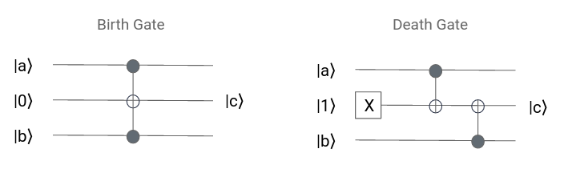
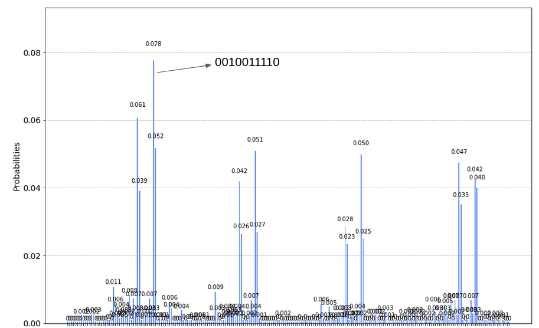

# GameOfLife

## Details and Results
Please take a look at our [slides](https://docs.google.com/presentation/d/1-FK0ITolNHTMyhXZYhNQD4zUGYBGhnhmuKOcbeG19Rw/edit?usp=sharing) to get more details.

## Introduction
Nature and Nurture are two factors which determine the fate. Nature focuses on the hereditary properties, whereas nurture pays attention to the interaction with the environment. Here, we would like to explore how these two factors affect the fate of the quantum state. In our quantum game, Game of Life, we present two subgames: Nature and Nurture. In the Nature sub-game, we design two elementary gates (the birth and death gate) and randomly apply them to the quantum circuit. After seeing the given random circuit, the user must choose an initial state which is most likely to survive. In the Nurture sub-game, we flip this around: we fix the initial quantum state and randomly assign the player a quantum operators set. Then, the player can use these operators to nurture the quantum state. Simultaneously, the environment would apply one-site or two-site quantum operators randomly on the qubits. The player's mission is to make the final state most likely to survice. When trying to learn how a quantum state evolves, we found that the formation of the entanglement seems to increase the survival probability. We believe our Nature and Nurture game can help players gain more sense of how a quantum life looks like. 

## Rules of the Game
### Nature

1. A circuit is built by randomly placing birth and death gates, and a few rotations 
2. The players have 10 seconds to see majority of the circuit
3. The players must then go around in a circle and choose which qubit they want to claim as their own - they will alternate choosing and end up with multiple qubits
4. Each player chooses which states to initialize their qubits in
5. The circuit is run on the initialized qubits and the qubits are measured - player one wins if the number of 1's measured is greater than the number of 0's measured

Running it on ionq.qpu 

### Nurture
1. Players choose the settings to play under: the number of qubits, the number of cnots per player, the number of additional random rotation gates per player, how many previous moves of the opponent to hide from the player, to run on simulator or hardware
2. Each player is randomly assigned a "hand" of gates which they have to use all of but in any order they choose
3. The specified number of qubits are initialized to 0's and the players alternate playing a gate on the qubit (qubits in the case of CNOT) of their choice
4. The gates the other player played are visible - except the last k moves (specified in the first step)
5. The qubits are measured and the player wins if more 1's are measured. If not, the computer wins

An example of a circuit in this subgame

Results on ionq.qpu

## Playing the Game
Open the [integrated notebook](https://github.com/VAddala9/GameOfLife/blob/main/IntegratedGameOfLife.ipynb) in Microsoft Azure Jupyter portal then follow prompts in the notebook.

## Benefits of the Game
In our quantum Game of Life, the player can develop a sense about what the essential factors affecting the unitary evolution are and choose the appropriate initial state/operator corresdpondly. Besides, the player can play with either the simulator and the hardware backend. For each game, we only require one run which saves waiting time and cost for using the hardware. The last but not least point is that the players can learn the difference between the single one-shot measurement and the expected result from multiple shots. The players can choose to play the game with "one shot" or the expected outcomes with multiple shots

## Future Work
The first possible future work is to increase the complexity in our Quantum Game of Life. We can add more real-life events in the Nature sub-game and more different operators in the Nurture sub-game. These improvements can help simulate a more realistic Quantum Life. Our quantum Game of Life raises an interesting question about how to setup the initial state/operators to win the game. Can we come with a quantum algorithm to optimize the survival probability in each step? We leave these interesting questions for our future work.

## Experience
We, the SuperPosers, worked well together and learned a lot from this hackathon. This was the first time for most of us to run code on quantum hardware and that was an exciting process for us to learn about. We brainstormed together about how we wanted to approach making a game and what we wanted our players to take away from playing the game. This helped us think more deeply about how we think about a quantum state evolving with a quantum circuit. With these in mind, we wanted to give the user a good experience with both the simulator and the hardware so we tailored our game to use the strengths of the hardware and tried to avoid any known current weaknesses. Overall we touched base quite frequently, kept reevaluating what we were working on, and had a great time!
